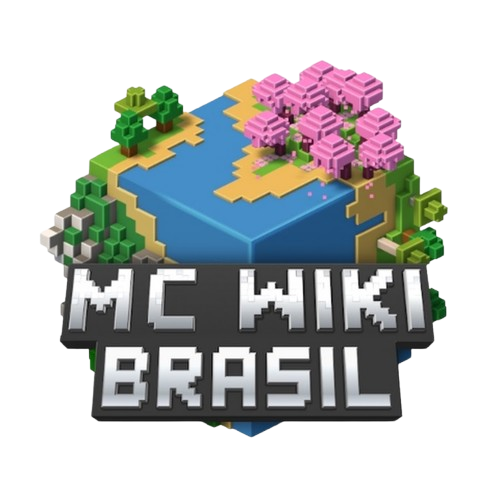
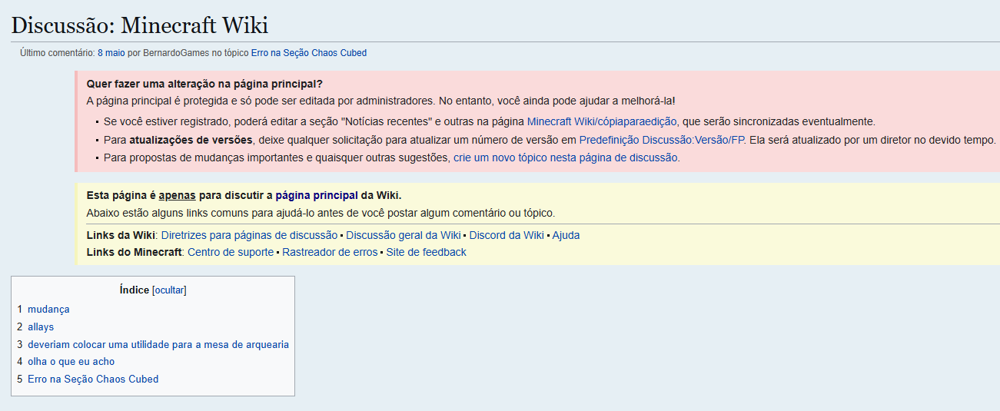

# Minecraft Wiki Brasil (Atividade README)
Repositório Informativo da Wiki Brasileira do jogo Minecraft (2009).

# O que é Minecraft?
**Minecraft** é um jogo de aventura sandbox em 3D desenvolvido pela **Mojang Studios** em que o jogador interage com um ambiente tridimensional totalmente modificável feito de blocos e entidades. Sua jogabilidade diversa permite que o jogador escolha a forma como joga, com inúmeras possibilidades.

Há várias edições do **Minecraft** que recebem manutenção ativa, sendo elas a:

- Edição **Java** para **Windows,** **macOS** e **Linux;**
- Edição **Bedrock** para **Windows,** **dispositivos móveis** e **consoles;** e
- **Minecraft Education,** uma variante da Edição Bedrock para salas de aula.
- Edição **China,** um lançamento localizado de ambas as edições para a China continental.

# O que é Minecraft Wiki 🌏?

O **Minecraft Wiki** (especificamente o Wiki Brasil) é um site destinado a compartilhar informações sobre o jogo **Minecraft(2009)** com a comunidade, conectando os jogadores brasileiros e ajudando novos players.
O Site conta com **16 subpáginas,** cada uma delas recheada de informações e dados sobre diversas áreas e itens do jogo, sendo elas:

1. [Comércio](https://pt.minecraft.wiki/w/Com%C3%A9rcio)
- Página sobre o comércio do jogo com NPCS (Aldeões).

2. [Fermentação](https://pt.minecraft.wiki/w/Fermenta%C3%A7%C3%A3o)
- Página sobre receitas e materiais para poções.

3. [Encantamento](https://pt.minecraft.wiki/w/Encantamento)
- Página sobre encantamentos de ferramentas (picareta, machado, etc).

4. [Criaturas](https://pt.minecraft.wiki/w/Criatura)
- Página sobre todas as criaturas do jogo (hostis, neutras e amigáveis).

5. [Blocos](https://pt.minecraft.wiki/w/Bloco)
- Página sobre os blocos do jogo.

6. [Itens](https://pt.minecraft.wiki/w/Item)
- Página sobre todos os itens do jogo.

7. [Biomas](https://pt.minecraft.wiki/w/Bioma)
- Página sobre todos os biomas do jogo.

8. [Efeitos](https://pt.minecraft.wiki/w/Efeito)
- Página sobre todos os efeitos (de poções) do jogo.

9. [Fabricação](https://pt.minecraft.wiki/w/Fabrica%C3%A7%C3%A3o)
- Página sobre fabricação de itens, objetos, blocos e ferramentas.

10. [Fundição](https://pt.minecraft.wiki/w/Fundi%C3%A7%C3%A3o)
- Página sobre fundição de minérios e como usar a fornalha.

11. [Ferraria](https://pt.minecraft.wiki/w/Ferraria)
- Página sobre ferraria (para atualizar ferramentas).

12. [Estruturas](https://pt.minecraft.wiki/w/Estrutura)
- Página sobre as estruturas espalhadas nos mapas do jogo.

13. [Redstone](https://pt.minecraft.wiki/w/Circuitos_de_redstone)
- Página sobre a mecânica de redstone.

14. [Comandos](https://pt.minecraft.wiki/w/Comandos)
- Página sobre todos os comandos do jogo.

15. [Histórico de Versões](https://pt.minecraft.wiki/w/Hist%C3%B3rico_de_vers%C3%B5es)
- Página sobre o histórico de versões do jogo.

16. [Tutoriais](https://pt.minecraft.wiki/w/Tutoriais)
- Página de tutoriais diversos do jogo.

# Aba de discussões🗨️

O site também conta com uma página dedicada a **discussões** entre usuários sobre o jogo. Assim como no GitHub, nesta página os usuários podem interagir com os outros e tirar dúvidas.

# Quem é o Público-alvo?

O site foca na **comunidade** de jogadores de **Minecraft,** mas também em transmitir conhecimento para aqueles que querem começar a jogar o jogo e entrar na comunidade.

# Como o Site foi feito?

O **Minecraft Wiki** foi produzido e programado com a mesma tecnologia do **Wikipedia,** sendo ela a [MediaWiki](https://www.mediawiki.org/wiki/MediaWiki)

# Requisitos

Para acessar o site, você precisará de acesso a internet e um computador/dispositivo móvel.

# Desenvolvedores

- Nicolas Bellasco (nicolaubanana-dev)
- Gabriel Santiago

